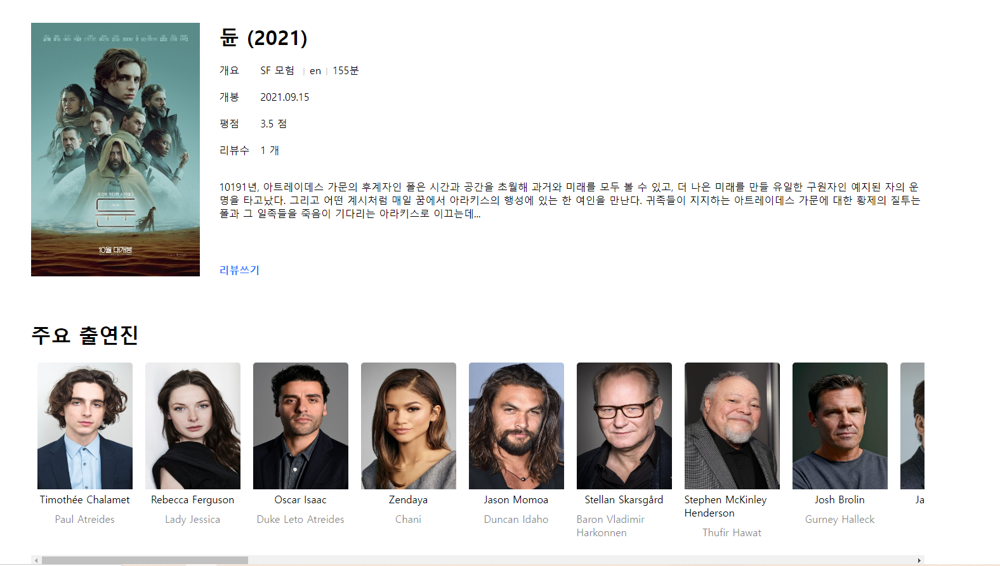

# 🎥 Moviestagram v1.0.0 (영화리뷰 커뮤니티)

## 🤔 사용한 기술 스택은 어떤건가요?

 

## 🤔 프로젝트의 기능들은 어떤 것이 있나요?

- 로그인, 회원가입
- JWT 토큰인증 (access token + refresh token)
- Open API를 이용한 영화 data 가져와서 화면에 보여주기
- 영화 리뷰 CRUD
- 댓글 CRUD
- 해시태그
- 좋아요

 

## 🤔 해결하기 어려웠던 구현 또는 이슈 사항은 무엇이었으며 어떻게 해결했나요?

### ❓ access token 과 refresh token 각각 어떻게 관리해야할까?

- access token 은 `redux state`로 관리하고, refresh token 은 `Secure` `Httponly` 쿠키로 관리했습니다.
- 이렇게 관리하면 CSRF 취약점 공격, XSS 취약점 공격으로부터 방어할 수 있다고 생각했습니다.
- 서버에게 API 콜을 요청했을때, `middleware` 를 통해 token을 검증했습니다.

### ❓ SQL vs ORM ?

- SQL은 SQL 문법을 알아야하기 때문에 `개발 속도가 저하`될 수 있지만 `복잡한 쿼리`를 좀 더 유연하게 구현할 수 있을거 같다고 생각했습니다.
- ORM은 `개발의 생산성 향상`, `DB 의존성 감소` 등 장점이 있지만 `복잡한 쿼리`를 표현하기가 힘들어보인다고 생각했습니다. (물론 해결법이 존재한다고 생각합니다.)
- 결론은 SQL을 배우고 싶어서 직접 SQL을 작성하는 방향으로 선택했습니다.

### ❓ Component 의 기준점 잡기

- 제가 정한 Component 나누는 기준은 다음과 같이 나누었습니다.
  - 얼마나 여러 번 사용하는가?
  - 컴포넌트의 size가 어느정도인가?

### ❓ 디자인 패턴 : MVC (props) vs flux (redux)

- 현재 제가 구현한 패턴은 MVC 패턴입니다. (React 학습 목적으로 진행했기 때문에 MVC 패턴으로 시작했습니다.)
- MVC 패턴의 큰 특징은 양방향 데이터 흐름인데, 규모가 커지면 예기치 못한 버그가 발생시킬수 있습니다.
- 후에 프로젝트에 좀 더 많은 기능들이 추가될 때에 MVC 패턴에 의해 발생할 수 있는 버그를 해결하기 위해 미리 flux 패턴으로 바꿀 예정입니다.

 

## 🤔 결과 화면이 궁금해요.

- 회원가입
  

   

- 로그인
  

   

- 홈

     

- 영화 검색 결과
  

   

- 특정 영화 페이지
  

   

- 리뷰 글
  

   

- 유저 정보

 

## 🤔 앞으로의 계획은 어떤 것이 있나요?

일단 제가 추가하고싶은 기능 및 수정사항은 다음과 같습니다.

- 지저분한 코드 리펙토링
- MVC 패턴을 flux 패턴으로 바꾸기
- 해시태그 검색 기능
- 영화 추천 알고리즘 수정
